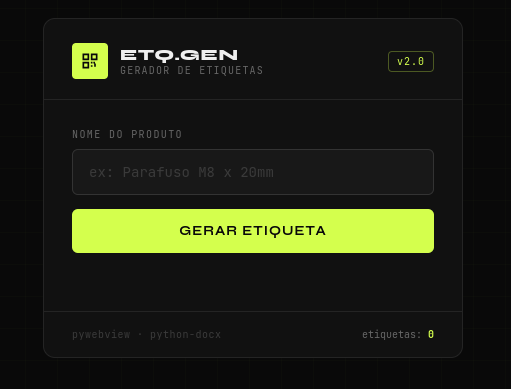

<div align="center">

```
███████╗████████╗ ██████╗      ██████╗ ███████╗███╗   ██╗
██╔════╝╚══██╔══╝██╔═══██╗    ██╔════╝ ██╔════╝████╗  ██║
█████╗     ██║   ██║   ██║    ██║  ███╗█████╗  ██╔██╗ ██║
██╔══╝     ██║   ██║▄▄ ██║    ██║   ██║██╔══╝  ██║╚██╗██║
███████╗   ██║   ╚██████╔╝    ╚██████╔╝███████╗██║ ╚████║
╚══════╝   ╚═╝    ╚══▀▀═╝      ╚═════╝ ╚══════╝╚═╝  ╚═══╝
```

### label generator with QR Code — built with Python + pywebview

<br/>


<br/>

</div>

---

## ◈ Overview
<div align="center">



</div>

**ETQ-GEN** is a lightweight desktop application for generating product labels with unique alphanumeric codes and QR codes, exported as `.docx` files ready for printing.

Built with a dark industrial UI using **HTML/CSS/JS** as the frontend and **Python** as the backend, bridged seamlessly by **pywebview** — no browser needed, no Electron bloat.

<br/>

## ◈ Features

| | Feature |
|---|---|
| `⬡` | Generates a unique 9-character alphanumeric code per product |
| `⬡` | Creates a QR Code (PNG) embedded in the label |
| `⬡` | Exports a ready-to-print `.docx` label (2×3 in) |
| `⬡` | Native desktop window — no browser launched |
| `⬡` | Lightweight: uses the OS's native WebView engine |
| `⬡` | One-click copy for the generated code |
| `⬡` | Session counter for generated labels |

<br/>

## ◈ Tech Stack

```
┌─────────────────────────────────────────────────────────────┐
│  FRONTEND          HTML5 · CSS3 · Vanilla JS                │
│  BRIDGE            pywebview 5.x                            │
│  QR CODE           qrcode[pil] + Pillow                     │
│  DOCUMENT          python-docx                              │
│  FONTS             JetBrains Mono · Syne (Google Fonts)     │
└─────────────────────────────────────────────────────────────┘
```

<br/>

## ◈ Project Structure

```
tag-generator/
│
├── main.py              ← entry point, creates the pywebview window
├── api.py               ← Python logic exposed to JS
├── requirements.txt
│
├── frontend/
│   ├── index.html       ← UI (dark industrial theme)
│   ├── style.css
│   └── js/
│       ├── api.js       ← pywebview bridge calls
│       ├── app.js       ← main app logic
│       └── ui.js        ← UI helpers
│
└── output/              ← generated at runtime (gitignored)
    ├── docs/            ← .docx label files
    └── qrcodes/         ← .png QR code images
```

<br/>

## ◈ Installation

### Windows

Works out of the box — Windows 10/11 includes WebView2 natively.

```bash
git clone https://github.com/your-username/tag-generator
cd tag-generator

python -m venv .venv
.venv\Scripts\activate

pip install -r requirements.txt
python main.py
```

---

### Linux (Arch / CachyOS / Manjaro)

Requires Qt backend for pywebview.

```bash
# Install Qt via system package manager
sudo pacman -S python-pyqt6 python-qtpy

# Clone and set up
git clone https://github.com/your-username/tag-generator
cd tag-generator

# Create venv with access to system Qt packages
python -m venv .venv --system-site-packages
source .venv/bin/activate

pip install -r requirements.txt
python main.py
```

> **Tip:** The `--system-site-packages` flag is required so the venv can access the Qt libraries installed via pacman.

---

### Linux (Debian / Ubuntu)

```bash
sudo apt install python3-pyqt6 python3-pyqt6.qtwebengine python3-qtpy

git clone https://github.com/your-username/tag-generator
cd tag-generator

python3 -m venv .venv --system-site-packages
source .venv/bin/activate

pip install -r requirements.txt
python3 main.py
```

<br/>

## ◈ Requirements

```txt
pywebview[qt]
qrcode[pil]
python-docx
Pillow
```

<br/>

## ◈ Usage

```
1. Type the product name in the input field
2. Press "Gerar Etiqueta" (or hit Enter)
3. The app generates:
     → a 9-char alphanumeric code
     → a QR Code image (output/qrcodes/)
     → a .docx label file  (output/docs/)
4. Use the COPY button to copy the code to clipboard
```

<br/>

## ◈ How It Works

```
┌──────────────┐     JS call      ┌─────────────────────┐
│  index.html  │ ──────────────►  │  api.py             │
│  (frontend)  │                  │                     │
│              │  ◄────────────── │  gerar_etiqueta()   │
│  renders QR  │   returns dict   │  → generates code   │
│  shows code  │   { sucesso,     │  → creates QR PNG   │
│              │     codigo,      │  → saves .docx      │
└──────────────┘     qr_b64 }     └─────────────────────┘
        ▲
        │  pywebview bridge
        │  window.pywebview.api.*
```

<br/>

## ◈ Output Example

```
output/
├── docs/
│   └── tag_A3KF82XNQ.docx
└── qrcodes/
    └── qrcode_A3KF82XNQ.png
```

Each `.docx` contains:
- Product name as heading
- Alphanumeric code
- QR Code image (1×1 in, centered)
- Page size: 2×3 inches, zero margins

<br/>

## ◈ License

```
MIT License — free to use, modify and distribute.
```

---

<div align="center">

*built with Python*

</div>